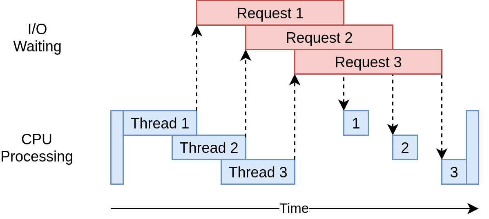

# deepCMSvdetector

Some pages made in Wordpress, Joomla, Drupal, etc. do not offer version information anywhere, or with tools we are able to get a version, with this tool thanks to the algorithms of Machine Learning you can detect a version of any CMS based on a series of classes.

## Quick start

We use the model randomforestmodel.pkl:

```
$ python3 ml-wpver.py -m test -u https://emetel.net/
```

To generate a new dataset:

```
$ python3 ml-wpver.py -gd 10000
```

To generate and train a new model (it'll be called randomforestmodel.pk1) and specify the dataset:

```
$ python3 ml-wpver.py -m train .csv
```


## Dataset

The classes of our dataset will be the size of the files that the WordPress CMS is made of, not all.

If we go to the: https://codex.wordpress.org/Current_events We'll see the files that changed in each version.

```
Ej:
En la 4.7.5 se modificaron los siguientes archivos:
wp-includes/class-wp-customize-manager.php
wp-includes/js/plupload/handlers.js
wp-includes/js/plupload/handlers.min.js
wp-includes/class-wp-xmlrpc-server.php
wp-includes/version.php
readme.html
wp-admin/about.php
wp-admin/includes/file.php
wp-admin/customize.php
wp-admin/js/updates.js
wp-admin/js/customize-controls.js
wp-admin/js/updates.min.js
wp-admin/js/customize-controls.min.js
```

If we download that version and the previous 4.7.4 and open the file: wp-includes/js/plupload/handlers.js

<p align="center"></p>

We see the lines change in that file. It would be necessary to download the total list of files that have been modified or added from version 0 to the last one and check how many lines the .js or .css files have

With python instead of counting the lines we will count the bytes of each .js or .css file, only those on the client side since the .php will not be able to visit them.

The first test emetel.net vs be-sec.net:

<p align="center"></p>

We will do a bigger check before continuing:
In these URLs we have 3 versions that are equal, and just give the same number of bytes in your files:

<p align="center"></p>

Since the wappalyzer API does not take the versions very well, we will take them out by hand looking in the source code for the <meta> tag that contains the version used:

<p align="center"></p>

There is a website called PublicWWW that allows us to search for certain code on the websites, that is, we can search for websites that have a certain version of WordPress:

<p align="center"></p>

Once all the URLs have been downloaded, we will have the following number of websites for each version:

<p align="center"></p>

Having a total of 172,394 urls which we will export to a csv:

<p align="center"></p>


## Multi-Class Classification algorithms

In the same way that the binary classification (binary classification) implies predicting if something is of one of two classes (for example, "black" or "white", "dead" or "alive", etc.), multiclass problems (Multi -class classification) involve classifying something into one of the N classes (for example, "red", "White" or "blue", etc.)

Common examples include the classification of images (it is a cat, dog, human, etc.) or the recognition of handwritten digits (classifying an image of a handwritten number into a digit from 0 to 9).
The scikit learn library offers a series of algorithms for Multi-Class classification, some such as:
-	K-nearest-neighbours (KNN).
-	Random Forest


## Dataset generation

We will generate our dataset, for each URL we will make 41 requests (the total number of classes), to save all the bytes. This will take us a long time since there are many URLs that we need, for this we will make simultaneous requests.


As this is an I / O program, that is, the bottleneck will be based on what it takes to visit that page and it will not depend so much on the processor we will use the threading method (https://realpython.com/python-concurrency/) :

<p align="center"></p>

```python
def get_bytes(url):
    session = get_session()
    try:
        with session.get(url, verify=False, timeout=5) as response:
            if response.status_code == 200:
                bytess = len(response.content)
            elif response.status_code != 200:
                bytess = 0
    except:
        bytess = 0
    return bytess

def create_dataset(url):
    ...
        with concurrent.futures.ThreadPoolExecutor(max_workers=4) as executor:
            bytess = list(executor.map(get_bytes, urlypath))
            for b in bytess:
                main_array.append(b)      
    ...

def create_dataset_multiple(urls):
    global count_iter 
    count_iter = -12
    with concurrent.futures.ThreadPoolExecutor(max_workers=12) as executor:
        df = pd.concat(executor.map(create_dataset, urls))
    return df
```

```python
df = pd.read_csv('final.csv')
urls = df['URLs'].sample(n=100000) 
create_dataset_multiple(urls)
```

## Training process

We load and separate our dataset by train (70%) and test (30%):

```python
df = pd.read_csv('20000.csv')
X = df.iloc[:, 1:-1].values
y = df.iloc[:, -1].values

from sklearn.model_selection import train_test_split
# 70% training 30% test
X_train, X_test, y_train, y_test = train_test_split(X, y, test_size=0.3)
```

Once the dataset is separated, we will train our model.

```python
from sklearn.ensemble import RandomForestClassifier

model = RandomForestClassifier(n_estimators=10, criterion='entropy', random_state=42)
model.fit(X_train, y_train)
```

We will see the accuracy:

```python
from sklearn.model_selection import cross_val_score

y_pred = model.predict(X_test)
from sklearn import metrics
print("Accuracy Random Forest:",metrics.accuracy_score(y_test, y_pred))
scores = cross_val_score(model, X_test, y_test, cv=5)
print("Accuracy Cross val score Random Forest: %0.2f (+/- %0.2f)" % (scores.mean(), scores.std() * 2))

```

We save our model:

```python
from sklearn.externals import joblib
joblib.dump(model, 'randomforestmodel.pkl') 
```

We make the predictions:

```python
# Creamos un dataframe en blanco
df = pd.DataFrame(columns=client)
create_dataset_to_predict("https://www.cloudways.com/blog/creating-custom-page-template-in-wordpress/")
X = df.iloc[:, 0:-1].values
model.predict(X)
```
