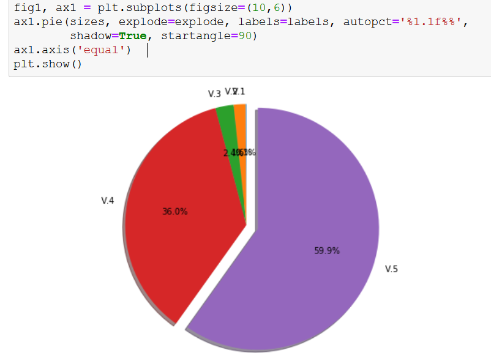

# ML-wpver

Algunas páginas de Wordpress, Joomla, Drupal, etc. no ofrecen información de la versión por ningún lado, ni con herramientas somos capaces de sacar una versión, con esta herramienta gracias a los algoritmos de Machine Learning se podrá detectar una versión de cualquier CMS en base a una serie de clases.


## Dataset

Las caracterísiticas de nuestro dataset serán los archivos de los que se compone el CMS WordPress, no todos.

Si nos vamos a la web: https://codex.wordpress.org/Current_events veremos los archivos que cambiaron en cada versión.

```
Ej:
En la 4.7.5 se modificaron los siguientes archivos:
wp-includes/class-wp-customize-manager.php
wp-includes/js/plupload/handlers.js
wp-includes/js/plupload/handlers.min.js
wp-includes/class-wp-xmlrpc-server.php
wp-includes/version.php
readme.html
wp-admin/about.php
wp-admin/includes/file.php
wp-admin/customize.php
wp-admin/js/updates.js
wp-admin/js/customize-controls.js
wp-admin/js/updates.min.js
wp-admin/js/customize-controls.min.js
```

Si nos descargamos esa versión y la anterior 4.7.4 y abrimos el archivo wp-includes/js/plupload/handlers.js:


Vemos que las líneas cambian en ese archivo. Habría que descargar el listado total de archivos que han sido modificados o añadidos de sde la versión 0 hasta la última y comprobar cuantas líneas tienen los archivos .js o .css

Con python en lugar de contar las líneas vamos a contar los bytes de cada archivo .js o .css, solo los del lado del cliente ya que los .php no los vamos a poder visitar.

Primera prueba emetel.net vs be-sec.net:
https://emetel.net/ versión 4.9.11
https://www.be-sec.net/ versión 5.0.6


Haremos una comprobación más grande antes de seguir:
En estas URLs tenemos 3 versiones que son iguales, y justamente da el mismo número de bytes en sus archivos:


Dado que la API de wappalyzer no saca muy bien las versiones, las sacaremos a mano buscando en el source code la etiqueta <meta> que contiene la versión usada:


Hay una web llamada PublicWWW que nos permite buscar determinado código en las webs, es decir podremos buscar webs que tengan una determinada versión de WordPress:


Una vez descargadas todas las URLs tendremos el siguiente numero de webs para cada versión:


Teniendo un total de 172.394 urls las cuales exportaremos a un csv:




Para escanear todos esos sitios web vamos a necesitar usar multiprocesado, sino vamos a tardar mucho:

Ejemplo de 20 webs:


## Multi-Class Classification

Del mismo modo que la clasificación binaria (binary classification) implica predecir si algo es de una de dos clases (por ejemplo, "negro" o "blanco", "muerto" o "vivo", etc.), los problemas multiclase (Multi-class classification) implican clasificar algo en una de las N clases (por ejemplo, "rojo", "Blanco" o "azul", etc.)

Los ejemplos comunes incluyen la clasificación de imágenes (es un gato, perro, humano, etc.) o el reconocimiento de dígitos escritos a mano (clasificar una imagen de un número escrito a mano en un dígito de 0 a 9).
La librería scikit learn ofrece una serie de algoritmos para Multi-Class classification, algunos como:
-	K-nearest-neighbours (KNN).
-	Random Forest

